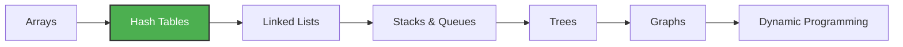

<div align="center">

# 📊 Data Structures & Algorithms


<br/><br/>

> _"First, solve the problem. Then, write the code."_  
> — **John Johnson**

<br/>

**A curated collection of DSA problems with step-by-step solutions**  
**Explained in English & Arabic | Built for learning & interview prep**

[View Problems](#-problems) • [Get Started](#-quick-start) • [Roadmap](#-topics-covered)

</div>

---

## 🎯 Why This Repository?

I created this repo to **document my learning journey** and help others who want to:

- ✅ Learn Data Structures & Algorithms from scratch
- ✅ Prepare for technical interviews (FAANG, startups, etc.)
- ✅ Understand the **thought process** behind each solution
- ✅ See both **brute-force** and **optimal** approaches

---

## 📝 Solution Format

Each problem follows a consistent, educational structure:

```
📌 Problem Statement     → Clear definition with examples
🧠 Thought Process       → How I approached it (Arabic & English)
🐢 Brute-Force Solution  → The naive approach
⚡ Optimal Solution      → The efficient approach
📊 Complexity Analysis   → Time & Space breakdown
✅ Test Cases            → Verification examples
```

---

## 📈 Problems

<div align="center">

### 🗃️ Hash Tables

| Problem                       | Difficulty | Key Concept              |                            Solution                            |
| ----------------------------- | :--------: | ------------------------ | :------------------------------------------------------------: |
| Birthday Problem              |  🟢 Easy   | Set for O(1) Lookup      |  [View](./Data-Structures/04-Hash-Tables/birthday_problem.ts)  |
| Two Sum                       |  🟢 Easy   | HashMap Complement       |      [View](./Data-Structures/04-Hash-Tables/two_sum.ts)       |
| 🎆 New Year Countdown         |  🟢 Easy   | Sorting + Circular Time  | [View](./Data-Structures/04-Hash-Tables/new_year_countdown.ts) |
| Group Anagrams                | 🟡 Medium  | Canonical Form + HashMap |   [View](./Data-Structures/04-Hash-Tables/group_anagrams.ts)   |
| 🔢 Longest Consecutive        | 🟡 Medium  | HashSet + Sequence Start | [View](./Data-Structures/04-Hash-Tables/longest_consecutive.ts)|
| ⚖️ Subarray Sum Equals K      | 🟡 Medium  | Prefix Sum + HashMap     | [View](./Data-Structures/04-Hash-Tables/subarray_sum_equals_k.ts)|
| 🎯 Top K Frequent Elements    | 🟡 Medium  | HashMap + Bucket Sort    | [View](./Data-Structures/04-Hash-Tables/top_k_frequent.ts)|
| 🪟 Minimum Window Substring   |  🔴 Hard   | Sliding Window + HashMap | [View](./Data-Structures/04-Hash-Tables/minimum_window_substring.ts)|
| 🔗 Substring Concatenation    |  🔴 Hard   | Sliding Window + HashMap | [View](./Data-Structures/04-Hash-Tables/substring_concatenation.ts)|

</div>

---

## 🗺️ Topics Covered



| Topic               |   Status   | Count |
| ------------------- | :--------: | :---: |
| Arrays              | 📝 Planned |   0   |
| **Hash Tables**     | ✅ Active  | **8** |
| Linked Lists        | 📝 Planned |   0   |
| Stacks & Queues     | 📝 Planned |   0   |
| Trees               | 📝 Planned |   0   |
| Graphs              | 📝 Planned |   0   |
| Dynamic Programming | 📝 Planned |   0   |

---

## 🚀 Quick Start

```bash
# Clone
git clone https://github.com/7amed3li/Data-Structures-and-Algorithms.git
cd Data-Structures-and-Algorithms

# Run any solution
npx tsx Data-Structures/04-Hash-Tables/two_sum.ts
```

---

## 📂 Structure

```
📦 Data-Structures-and-Algorithms
 ┣ 📂 Data-Structures
 ┃ ┗ 📂 04-Hash-Tables
 ┃   ┣ 📜 birthday_problem.ts
 ┃   ┣ 📜 two_sum.ts
 ┃   ┣ 📜 new_year_countdown.ts
 ┃   ┣ 📜 new_year_visualizer.html
 ┃   ┣ 📜 group_anagrams.ts
 ┃   ┣ 📜 longest_consecutive.ts
 ┃   ┣ 📜 minimum_window_substring.ts
 ┃   ┣ 📜 substring_concatenation.ts
 ┃   ┗ 📜 top_k_frequent.ts
 ┗ 📜 README.md
```

---

## 💡 Key Patterns

<table>
<tr>
<td width="50%">

### 🔑 Hash Map Pattern

```typescript
const map = new Map<number, number>();

for (let i = 0; i < nums.length; i++) {
  const complement = target - nums[i];
  if (map.has(complement)) {
    return [map.get(complement)!, i];
  }
  map.set(nums[i], i);
}
```

</td>
<td width="50%">

### 🎯 Use Cases

- Finding pairs/complements
- Frequency counting
- Duplicate detection
- Quick O(1) lookups

</td>
</tr>
</table>

---

## 📊 Complexity Reference

| Structure      |  Access  |  Search  |  Insert  |  Delete  |
| -------------- | :------: | :------: | :------: | :------: |
| Array          |   O(1)   |   O(n)   |   O(n)   |   O(n)   |
| **Hash Table** |    -     | **O(1)** | **O(1)** | **O(1)** |
| Linked List    |   O(n)   |   O(n)   |   O(1)   |   O(1)   |
| Binary Tree    | O(log n) | O(log n) | O(log n) | O(log n) |

---

## 🤝 Contributing

Found this helpful? Feel free to:

- ⭐ Star this repo
- 🍴 Fork and add solutions
- 📝 Suggest improvements

---

<div align="center">

## 👨‍💻 Author

**Hamed Mohamed**

[](https://github.com/7amed3li)
[](https://www.linkedin.com/in/h-amedmohamed/)

---

_Learning in public, one algorithm at a time_ 🚀

</div>
